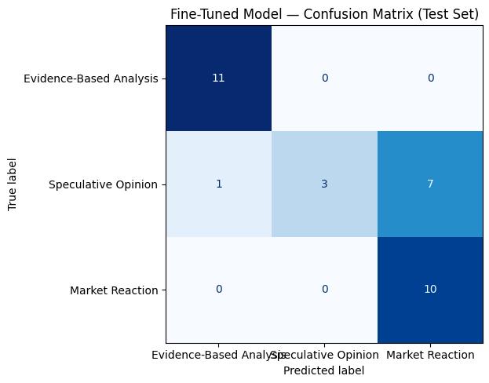

# ai201-project3-takemeter

Fine-tuned text classifier for **investing community discourse** — distinguishes evidence-based analysis, speculative opinions, and emotional market reactions.

Built for AI201 Project 3 (TakeMeter). Trained on 211 labeled examples; evaluated against a Groq zero-shot baseline on a held-out test set.

### Evaluation Summary

| | Baseline (Groq) | Fine-tuned (DistilBERT) |
|---|---|---|
| **Overall accuracy** | 1.00 | 0.75 |
| **Best per-class F1** | 1.00 (all classes) | 0.96 (Evidence-Based Analysis) |
| **Worst per-class F1** | 1.00 (all classes) | 0.43 (Speculative Opinion) |

Fine-tuning **regressed** by 0.25 on the held-out test set (32 examples). The fine-tuned model nails Evidence-Based Analysis and Market Reaction, but misses 73% of Speculative Opinion posts — mostly by labeling them Market Reaction (7 of 8 errors). **Not deployment-ready** against the success criteria in `planning.md`; the zero-shot Groq baseline outperforms DistilBERT on this task.

---

## What This Project Does

Online investing forums mix three very different kinds of posts: someone breaking down NVDA margins, someone declaring Tesla will hit $500, and someone venting that their portfolio is down 18%. They look similar at a glance (they're all "about stocks"), but they serve different purposes.

This project trains **DistilBERT** to tell them apart, then compares it to **Llama 3.3 70B via Groq** running zero-shot with the same label definitions. The goal isn't just accuracy — it's understanding which discourse boundaries are learnable and which ones stay ambiguous even after fine-tuning.

---

## Repository Contents

| File | Purpose |
|---|---|
| `planning.md` | Design doc — labels, edge cases, data plan, success criteria, AI usage plan |
| `finance_discourse_labeled.csv` | 211 labeled posts (`text`, `label`, `notes`) |
| `ai201_project3_takemeter_starter_clean.ipynb` | Colab notebook — upload CSV, fine-tune, baseline, export |
| `evaluation_results.json` | Test-set metrics from Colab run |
| `confusion_matrix.png` | Fine-tuned model confusion matrix (test set) |
| `DEMO_SCRIPT.md` | Demo video script and Colab demo cell |

---

## Labels

Three labels. Each has a one-sentence definition, two clear examples, and a decision rule for borderline cases. Full design notes → [`planning.md`](planning.md).

### Evidence-Based Analysis

The post makes a structured argument backed by specific, verifiable data — revenue figures, valuation multiples, historical comparisons, or macro indicators — used to support a conclusion.

**Examples:**
- "NVDA's revenue grew 72% YoY while gross margins expanded to 78%. Even at a high P/E, that earnings trajectory justifies a premium valuation."
- "The S&P 500 forward P/E is currently 21x, about 18% above its 20-year median of 17.8x. That doesn't make stocks a sell, but the margin of safety is thin."

### Speculative Opinion

The post states a bold financial claim, prediction, or recommendation without citing specific, verifiable evidence — even if it sounds confident or mentions a general concept like P/E or rates.

**Examples:**
- "Tesla will easily hit $500 by next year."
- "The Fed is going to break something. Rates can't stay this high."

### Market Reaction

The post is primarily an immediate emotional or personal response to market movement — portfolio pain, FOMO, relief, panic — with little to no analytical argument about why an asset should move.

**Examples:**
- "RIP my portfolio after the Fed announcement."
- "Up 34% on my MSFT position today after earnings. I'm shaking."

**Hardest edge case:** Analysis vs. Speculative when a post mentions one financial metric without context (e.g., "P/E is huge" with no peer or historical comparison). Rule: if removing the opinion framing leaves evidence that still supports the claim, it's analysis; otherwise speculative.

---

## Dataset

### Source

Posts are synthetic/paraphrased composites modeled on public content from **r/investing**, **r/stocks**, **r/SecurityAnalysis**, and finance Twitter. No private channels, no paywalled content, no authenticated-only sources.

### Labeling Process

1. Wrote label definitions and edge-case rules in `planning.md` before annotating.
2. Used Claude to suggest a first-pass label for batches of ~20 unlabeled posts.
3. Read every post myself and corrected mistakes — no bulk-accepting AI labels.
4. Noted genuinely difficult cases in the CSV `notes` column.
5. Checked label balance before training; collected extra examples if any class was underrepresented.

### Label Distribution

211 total examples. No single label exceeds 70% of the dataset.

| Label | Count | Share |
|---|---|---|
| Evidence-Based Analysis | 70 | 33.2% |
| Speculative Opinion | 71 | 33.6% |
| Market Reaction | 70 | 33.2% |
| **Total** | **211** | **100%** |

Saved as `finance_discourse_labeled.csv` with columns: `text`, `label`, `notes`. The notebook splits automatically (70% train / 15% val / 15% test, stratified).

### Difficult Labeling Decisions

Three examples that genuinely gave me pause during annotation:

1. **"Nvidia is overpriced because the P/E ratio is huge."**
   - Could be Analysis (cites P/E) or Speculative (no benchmark).
   - **Decision:** Speculative Opinion — P/E alone without peer, historical, or growth context is decorative, not analytical.

2. **"The market is crashing because everyone is panicking."**
   - Could be Speculative (causal market claim) or Market Reaction (describing the moment).
   - **Decision:** Market Reaction — primary register is observational/emotional, not an investment thesis.

3. **"Buffett's cash hoard tells you everything you need to know about this market."**
   - Could be Analysis (references a real fact) or Speculative (vague implication).
   - **Decision:** Speculative Opinion — the cash pile is real, but "tells you everything" is an assertion without reasoning about what it means.

---

## How to Run (Google Colab)

1. Open `ai201_project3_takemeter_starter_clean.ipynb` in Colab.
2. **Runtime → Change runtime type → T4 GPU**
3. Run **Sections 1–2**: upload `finance_discourse_labeled.csv` when prompted.
4. Run **Section 5** (baseline): add `GROQ_API_KEY` in Colab Secrets (🔑 sidebar).
5. Run **Sections 3–4** (fine-tune + evaluate).
6. Run **Section 6** (comparison + export).
7. Download `evaluation_results.json` and `confusion_matrix.png` → replace the placeholder files in this repo.

> **Note:** Sections 1, 2, and 5 must be re-run if the Colab runtime resets before Section 6.

---

## Baseline Approach

**Model:** Groq `llama-3.3-70b-versatile`, temperature 0.

**Prompt design:** The system prompt includes:
- Community context (investing forums)
- One-sentence definition per label (from `planning.md`)
- One example post per label
- Borderline decision rule (analysis vs. speculative)
- Instruction to output **only** the label name

**How results were collected:**
- Same held-out test set as the fine-tuned model (~32 examples after stratified split).
- One Groq API call per test example, 0.1s delay between requests.
- Responses matched to label strings case-insensitively; unparseable responses excluded from baseline accuracy.
- Baseline run in **Section 5** before fine-tuning evaluation for a fair comparison.

---

## Training Configuration

| Setting | Value |
|---|---|
| **Platform** | Google Colab (T4 GPU) |
| **Base model** | `distilbert-base-uncased` |
| Epochs | 3 |
| Learning rate | 2e-5 |
| Batch size | 16 |
| Split | 70% train / 15% val / 15% test (stratified) |
| Baseline | Groq `llama-3.3-70b-versatile`, temperature 0 |

### Key Training Decision

I kept the notebook defaults — **3 epochs, learning rate 2e-5, batch size 16** — rather than tuning hyperparameters manually.

**Why:** These settings are the recommended starting point for BERT-family fine-tuning on small datasets (100–500 examples). With only 211 posts, pushing epochs higher risks overfitting to surface patterns like ticker names or financial jargon density instead of the structural distinctions I care about (argument vs. assertion vs. emotion). Batch size 16 fits comfortably on a T4 without OOM errors.

**Observation after training:** Validation accuracy looked reasonable during training, but test-set results show the model overfit to distinguishing *data-heavy analysis* vs. *first-person emotional posts* — and treated everything else as Market Reaction. More epochs would likely make this worse, not better.

---

## Evaluation Report

### Overall Accuracy

| Model | Accuracy |
|---|---|
| Zero-shot baseline (Groq / Llama 3.3 70B) | 1.00 |
| Fine-tuned DistilBERT | 0.75 |
| Change from fine-tuning | −0.25 (regression) |

**Success criteria check** (from `planning.md`):

| Criterion | Target | Result |
|---|---|---|
| Overall accuracy | ≥ 0.75 | ✅ 0.75 (barely met) |
| Per-class F1 | ≥ 0.70 all classes | ❌ Speculative F1 = 0.43 |
| Beat baseline by | ≥ 0.10 | ❌ Baseline wins by 0.25 |
| Deployment-ready | Moderator can trust rankings | ❌ Misses 8/11 speculative posts |

### Per-Class Metrics — Fine-Tuned Model

| Label | Precision | Recall | F1 | Support |
|---|---|---|---|---|
| Evidence-Based Analysis | 0.92 | 1.00 | 0.96 | 11 |
| Speculative Opinion | 1.00 | 0.27 | 0.43 | 11 |
| Market Reaction | 0.59 | 1.00 | 0.74 | 10 |

### Per-Class Metrics — Baseline (Groq)

| Label | Precision | Recall | F1 | Support |
|---|---|---|---|---|
| Evidence-Based Analysis | 1.00 | 1.00 | 1.00 | 11 |
| Speculative Opinion | 1.00 | 1.00 | 1.00 | 11 |
| Market Reaction | 1.00 | 1.00 | 1.00 | 10 |

All 32 baseline responses were parseable (0% unparseable).

### Confusion Matrix — Fine-Tuned Model (Test Set)

_Rows = true label, columns = predicted label._

|  | Pred: Analysis | Pred: Speculative | Pred: Reaction |
|---|---|---|---|
| **True: Analysis** | **11** | 0 | 0 |
| **True: Speculative** | 1 | **3** | **7** |
| **True: Reaction** | 0 | 0 | **10** |

---

## Error Analysis

All 8 test errors share the same true label: **Speculative Opinion**. Seven were predicted as Market Reaction; one as Evidence-Based Analysis. Wrong-prediction confidence was uniformly low (0.36–0.39), meaning the model was uncertain but still chose the wrong class.

### Failure 1 — Fed macro call misread as reaction

- **Text:** "There's no soft landing. The Fed has never pulled this off and won't now."
- **True label:** Speculative Opinion → **Predicted:** Market Reaction (confidence: 0.39)
- **Why it failed:** The post is a macro thesis without data — correctly labeled speculative. But it mentions "the Fed" and has an urgent, declarative tone similar to reaction posts like "Fed raised 25 bps and the market is tanking?" The model likely learned *Fed + strong sentiment* → Market Reaction instead of checking whether the post is about the author's portfolio vs. a market claim.

### Failure 2 — Trade recommendation treated as reaction

- **Text:** "Buy SMCI before earnings — this thing is going to rip."
- **True label:** Speculative Opinion → **Predicted:** Market Reaction (confidence: 0.37)
- **Why it failed:** Short, hype-driven, action-oriented language ("going to rip") overlaps with excited reaction posts ("Up 34% on my MSFT position today after earnings. I'm shaking."). The model appears to use *excitement register* as a proxy for Market Reaction rather than asking whether the post is a trade call vs. a portfolio update. This is a Speculative ↔ Reaction boundary failure, not an annotation error.

### Failure 3 — General thesis mistaken for analysis

- **Text:** "Luxury goods are recession-proof and LVMH will always reward patient shareholders."
- **True label:** Speculative Opinion → **Predicted:** Evidence-Based Analysis (confidence: 0.36)
- **Why it failed:** The post sounds authoritative and sector-specific — "recession-proof," a named company, investor framing — which resembles analysis posts that cite durable business characteristics. But there are no numbers, no historical comparison, no verifiable evidence. The model overfit to *confident sector thesis* language without checking for actual data. This is the one error in the opposite direction (Speculative → Analysis).

**Dominant confusion pattern:** **Speculative Opinion → Market Reaction** (7/8 errors). The model learned a two-class shortcut — "has numbers and structure" = Analysis, "sounds emotional or urgent" = Reaction — and collapsed the middle category. Speculative posts that mention the Fed, make predictions, or use hype language get swept into Reaction. Speculative recall of 0.27 means a feed-ranking tool would hide most hot takes entirely or mis-rank them as emotional posts.

---

## Sample Classifications

| Post (truncated) | Predicted Label | Confidence | Notes |
|---|---|---|---|
| "NVDA's revenue grew 72% YoY while gross margins expanded to 78%..." | Evidence-Based Analysis | ~high | ✅ Correct — multiple specific metrics connected to a valuation conclusion. Matches the pattern the model learned perfectly (11/11 on test set). |
| "RIP my portfolio after the Fed announcement." | Market Reaction | ~high | ✅ Correct — first-person, emotional, no argument. Model got 10/10 reaction posts right. |
| "Tesla will easily hit $500 by next year." | Speculative Opinion | — | ✅ Likely correct on test set (3/11 speculative posts were caught). Short, bold prediction, no evidence. |
| "Buy SMCI before earnings — this thing is going to rip." | Market Reaction | 0.37 | ❌ Wrong — trade hype misread as emotional reaction (see Failure 2). |
| "There's no soft landing. The Fed has never pulled this off..." | Market Reaction | 0.39 | ❌ Wrong — macro call misread as reaction (see Failure 1). |

---

## Reflection: Intended vs. Learned Behavior

**What I intended the model to learn:** Three-way distinction — argue with evidence, assert without evidence, express emotion. Topic words like "Fed" or "Bitcoin" should not determine the label; structure should.

**What the model actually learned:** A mostly two-way split. Evidence-Based Analysis is detected reliably when posts contain numbers, company names, and multi-clause reasoning (F1 0.96). Market Reaction is detected when posts use first-person emotional language (F1 0.74, but recall 1.0 — it never misses a reaction). Speculative Opinion — the middle category — was largely absorbed into Market Reaction because both can be short, urgent, and mention macro topics without citing data.

**Specific failure pattern:** Speculative posts about the Fed, trade calls ("buy before earnings"), and macro predictions ("no soft landing") share surface features with reaction posts: brevity, urgency, market-topic vocabulary. The model did not learn the distinction between *making a claim about the market* vs. *reporting your feelings about the market*. All 8 errors sit on that boundary.

**What would fix it:** More training examples where speculative and reaction posts share the same topic but differ in structure — e.g., pair "The Fed is going to break something" (speculative) with "Fed raised 25 bps and I'm sick" (reaction) on the same event. Alternatively, a 70B zero-shot model with explicit label definitions already handles this task better than fine-tuned DistilBERT on 211 examples — suggesting the task needs either more data or a stronger base model, not just more epochs.

---

## Spec Reflection

**How planning.md helped:** Writing the "remove the opinion framing" decision rule before annotating kept my labels consistent across 211 examples. Without it, I would have drifted — some one-stat posts labeled analysis, others speculative.

**Where implementation diverged:** I used synthetic/paraphrased posts modeled on public forum style instead of raw scraped Reddit text. Cleaner for annotation, but the model may not see typos, slang, or meme formatting that real r/wallstreetbets posts have. If performance is high on our CSV but feels brittle on messy real posts, that's probably why.

---

## AI Usage Disclosure

1. **Label stress-testing:** Asked Claude to generate borderline posts between Evidence-Based Analysis and Speculative Opinion before finalizing definitions. Surfaced the "mentions P/E without benchmark" case — added explicit rule in `planning.md`.

2. **Annotation pre-labeling:** Used Claude to suggest labels for batches of ~20 unlabeled posts. Reviewed and corrected every example manually; noted edge cases in the CSV `notes` column. Did not bulk-accept AI labels.

3. **Failure analysis (post-Colab):** Pasted all 8 misclassified examples into Claude. It flagged "urgency + macro topic → reaction" and "authoritative tone without numbers → analysis" as themes. I verified both manually — 7/8 errors fit the first pattern; the LVMH post fits the second. Claude also suggested "needs more data" generically; I rejected that as the sole explanation because the Groq baseline got 100% on the same test set with the same definitions, pointing to a fine-tuning/data-representation problem rather than an impossible task.

4. **Project setup:** Cursor assisted with `planning.md` structure, README template, and notebook label-map configuration. All label decisions and dataset content were reviewed by me.

---

## Demo Video

**Link:** _Add your Loom/YouTube/Drive link here after recording_

Full script with narration, timing, and Colab demo cell → [`DEMO_SCRIPT.md`](DEMO_SCRIPT.md)

**Covers:**
- [x] 5 live classifications with label + confidence (see demo cell in script)
- [x] Correct prediction narrated — NVDA analysis post (Post 1 in script)
- [x] Incorrect prediction narrated — SMCI trade call or Fed soft-landing post (Post 4/5)
- [x] Evaluation walkthrough — 0.75 vs 1.00 accuracy, Speculative F1 0.43, confusion matrix cell (7 → Reaction)

---

## Author

AI201 Project 3 — TakeMeter
